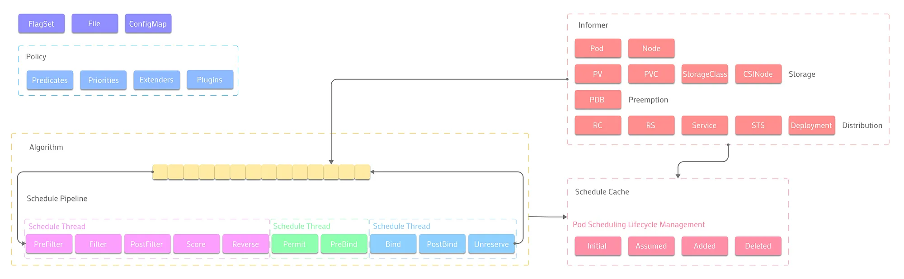

# Kubernetes Scheduling

## Index
- [Overview](#overview)
- [Analogy](#analogy)
- [Importance of Efficient Scheduling](#importance-of-efficient-scheduling)
- [Scheduling Process](#scheduling-process)
- [Components](#components)
- [Customization](#customization)
- [Scheduling Algorithms](#scheduling-algorithms)
- [Types of Scheduling Criteria](#types-of-scheduling-criteria)
- [Advanced Concepts](#advanced-concepts)
- [Conclusion](#conclusion)


## Overview
- **Purpose**: Assign pods (groups of one or more containers) to nodes in a cluster.
- **Primary Objective**: Optimize resource utilization and ensure smooth and efficient application performance.
- **Factors Considered**:
  - Hardware capabilities
  - Available resources
  - Quality of Service (QoS)
  - Affinity settings

## Analogy
- Similar to assigning tasks to team members based on their strengths and current workload. Poor scheduling can lead to some nodes being overwhelmed while others remain idle.

## Importance of Efficient Scheduling
- Maximizes resource utilization
- Improves application performance
- Ensures high availability in a Kubernetes cluster
- Enables workload distribution, load balancing, and fault tolerance
- Optimizes resource allocation
- Minimizes bottlenecks
- Provides a seamless user experience

## Scheduling Process
1. **Pod Creation**: When a new pod is created, it doesn't know which node to run on and will be in a pending state.
2. **Filtering Phase**: Kubernetes eliminates nodes that are not suitable for running a pod.
3. **Scoring Phase**: Kubernetes assigns a score to each remaining node based on various criteria.
4. **Node Selection**: The node with the highest score is selected as the best fit for the pod.



## Components
- **Predicates**: Boolean functions used for filtering nodes.
    - `PodFitsResources`: Checks if a node has enough CPU and memory.
    - `PodFitsHost`: Checks if a pod has a specific hostname requirement.
    - `PodFitsHostPorts`: Checks if a node has free ports for a pod’s host port mappings.
    - `PodSelectorMatches`: Checks if a pod’s node selector matches a node’s labels.
    - `NoDiskConflict`: Checks if a pod’s volume mounts conflict with any other pod’s volume mounts on the same node.
- **Priorities**: Numeric functions used for scoring nodes.
    - `LeastRequestedPriority`: Favors nodes with lower resource utilization.
    - `BalancedResourceAllocation`: Favors nodes with balanced resource utilization across CPU and memory.
    - `NodeAffinityPriority`: Favors nodes that match a pod’s node affinity preferences.
    - `InterPodAffinityPriority`: Favors nodes that match a pod’s inter-pod affinity and anti-affinity preferences.
- **Extenders**: External processes that run alongside the scheduler to provide additional filtering and scoring logic.


## Customization
- **Node Selectors**: Specify key-value pairs that must match node labels. Best for simple, direct placement of pods on specific nodes.
    ```yaml
    apiVersion: v1
    kind: Pod
    metadata:
        name: nginx
    spec:
        containers:
        - name: nginx
            image: nginx
        nodeSelector:
            disktype: ssd
    ```
    This ensures that the pod is scheduled only on nodes with the label `disktype=ssd`.

- **Node Affinity and Anti-Affinity**: Define rules for pod placement based on node labels. Useful for more complex scheduling requirements.

    Node Affinity and Anti-Affinity are advanced scheduling features in Kubernetes that allow you to control which nodes your pods can be scheduled on, based on node labels. This is more flexible and expressive compared to simple node selectors.

    **Node Affinity**: Specifies rules for placing pods on nodes with specific labels.
    
    **Node Anti-Affinity**: Specifies rules to avoid placing pods on nodes with specific labels.

    **Types of Node Affinity**:
    - `requiredDuringSchedulingIgnoredDuringExecution`: This rule must be met for the pod to be scheduled on a node. However, if the node's labels change after the pod is scheduled, the pod will not be evicted.
    - `preferredDuringSchedulingIgnoredDuringExecution`: This rule is preferred but not mandatory for scheduling the pod. The scheduler will try to place the pod on a node that meets the criteria, but if no such node is available, the pod will still be scheduled on another node.

    **Example**:
    ```yaml
    apiVersion: v1
    kind: Pod
    metadata:
        name: nginx
    spec:
        affinity:
            nodeAffinity:
                requiredDuringSchedulingIgnoredDuringExecution:
                    nodeSelectorTerms:
                    - matchExpressions:
                        - key: disktype
                          operator: In
                          values:
                          - ssd
        containers:
        - name: nginx
          image: nginx
    ```
    ## Node Selection Function

    ```javascript
    /**
     * This function is used to select nodes based on specific criteria.
     * 
     * @param {Object} nodeSelector - An object that specifies the criteria for selecting nodes. 
     *                                It contains key-value pairs where the key is the label and 
     *                                the value is the expected value of that label.
     * 
     * @param {Object} matchExpression - An object that specifies more complex criteria for selecting nodes.
     *                                   It contains an array of expressions, where each expression includes:
     *                                   - key: The label key to match.
     *                                   - operator: The operator to apply (e.g., In, NotIn, Exists, DoesNotExist).
     *                                   - values: An array of values to match against (used with In and NotIn operators).
     * 
     * Note:
     * - `nodeSelector` is simpler and only allows for exact matches on labels.
     * - `matchExpression` is more flexible and allows for more complex matching logic.
     * 
     * Both `nodeSelector` and `matchExpression` are used in Kubernetes to control which nodes a pod can be scheduled on.
     * 
     * Example:
     * 
     * nodeSelector:
     * {
     *   "disktype": "ssd",
     *   "region": "us-west"
     * }
     * 
     * matchExpression:
     * [
     *   {
     *     "key": "disktype",
     *     "operator": "In",
     *     "values": ["ssd", "nvme"]
     *   },
     *   {
     *     "key": "region",
     *     "operator": "NotIn",
     *     "values": ["us-east"]
     *   }
     * ]
     * 
     * In this example, `nodeSelector` will select nodes with labels `disktype=ssd` and `region=us-west`.
     * `matchExpression` will select nodes with `disktype` either `ssd` or `nvme` and `region` not `us-east`.
     */
    ```

    In this example:
    - The pod will only be scheduled on nodes with the label `disktype=ssd`.
    - The `requiredDuringSchedulingIgnoredDuringExecution` rule ensures that the pod is placed on a node that meets the criteria at the time of scheduling. However, if the node's labels change after the pod is running, the pod will not be evicted.

    **Example of `preferredDuringSchedulingIgnoredDuringExecution`**:
    ```yaml
    apiVersion: v1
    kind: Pod
    metadata:
        name: nginx
    spec:
        affinity:
            nodeAffinity:
                preferredDuringSchedulingIgnoredDuringExecution:
                - weight: 1
                  preference:
                    matchExpressions:
                    - key: disktype
                      operator: In
                      values:
                      - ssd
        containers:
        - name: nginx
          image: nginx
    ```
    In this example:
    - The scheduler will prefer to place the pod on nodes with the label `disktype=ssd`, but if no such node is available, the pod will still be scheduled on another node.
    - The `weight` field indicates the preference strength. Higher weights increase the likelihood of the pod being scheduled on nodes that match the criteria. The weight value ranges from 1 to 100. This field is not present in `requiredDuringSchedulingIgnoredDuringExecution` because that rule is mandatory and does not involve preference.

    **Example with weight 1**:
    ```yaml
    apiVersion: v1
    kind: Pod
    metadata:
        name: nginx
    spec:
        affinity:
            nodeAffinity:
                preferredDuringSchedulingIgnoredDuringExecution:
                - weight: 1
                  preference:
                    matchExpressions:
                    - key: disktype
                      operator: In
                      values:
                      - ssd
        containers:
        - name: nginx
          image: nginx
    ```
    In this example, the scheduler will have a low preference for placing the pod on nodes with the label `disktype=ssd`. If there are other nodes available, the pod might be scheduled on those nodes instead.

    **Example with weight 80**:
    ```yaml
    apiVersion: v1
    kind: Pod
    metadata:
        name: nginx
    spec:
        affinity:
            nodeAffinity:
                preferredDuringSchedulingIgnoredDuringExecution:
                - weight: 80
                  preference:
                    matchExpressions:
                    - key: disktype
                      operator: In
                      values:
                      - ssd
        containers:
        - name: nginx
          image: nginx
    ```
    In this example, the scheduler will have a high preference for placing the pod on nodes with the label `disktype=ssd`. The pod is more likely to be scheduled on these nodes compared to nodes without the label.


    **Example of Node Anti-Affinity**:
    ```yaml
    apiVersion: v1
    kind: Pod
    metadata:
        name: nginx
    spec:
        affinity:
            nodeAffinity:
                requiredDuringSchedulingIgnoredDuringExecution:
                    nodeSelectorTerms:
                    - matchExpressions:
                        - key: disktype
                          operator: NotIn
                          values:
                          - hdd
        containers:
        - name: nginx
          image: nginx
    ```
    In this example:
    - The pod will be scheduled on nodes that do not have the label `disktype=hdd`.
    - The `requiredDuringSchedulingIgnoredDuringExecution` rule ensures that the pod is placed on a node that meets the criteria at the time of scheduling. However, if the node's labels change after the pod is running, the pod will not be evicted.


    **Why Use Node Affinity and Anti-Affinity?**:
    - **Workload Isolation**: Ensure that certain workloads run on specific types of nodes, such as those with SSDs for high I/O performance.
    - **Resource Optimization**: Place pods on nodes that are best suited for their resource requirements.
    - **Fault Tolerance**: Distribute pods across different nodes to avoid single points of failure.

    **Additional Concepts**:
    - **Pod Affinity and Anti-Affinity**: Similar to Node Affinity and Anti-Affinity, but these rules apply to the placement of pods relative to other pods, rather than nodes.
    - **Taints and Tolerations**: Another mechanism to control pod placement by marking nodes with taints and allowing pods with matching tolerations to be scheduled on them.

    This allows for more flexible and expressive rules compared to node selectors.

    ## Taints and Tolerations

    ### Overview
    Taints and tolerations are mechanisms in Kubernetes that work together to ensure that pods are not scheduled onto inappropriate nodes. Taints are applied to nodes, and tolerations are applied to pods. This allows nodes to repel a set of pods unless those pods explicitly tolerate the taint.

    ### Taints
    A taint is a key-value pair associated with an effect that is applied to a node. The effect can be one of the following:
    - `NoSchedule`: Pods that do not tolerate the taint will not be scheduled on the node.
    - `PreferNoSchedule`: Kubernetes will try to avoid scheduling pods that do not tolerate the taint on the node, but it is not guaranteed.
    - `NoExecute`: Pods that do not tolerate the taint will be evicted if they are already running on the node.

    **Example of applying a taint to a node**:
    ```bash
    kubectl taint nodes node1 key=value:NoSchedule
    ```
    This command applies a taint with key `key`, value `value`, and effect `NoSchedule` to `node1`.

    ### Tolerations
    A toleration is a key-value pair associated with an effect that is applied to a pod. Tolerations allow the pod to be scheduled on nodes with matching taints.

    **Example of adding a toleration to a pod**:
    ```yaml
    apiVersion: v1
    kind: Pod
    metadata:
        name: nginx
    spec:
        tolerations:
        - key: "key"
          operator: "Equal"
          value: "value"
          effect: "NoSchedule"
        containers:
        - name: nginx
          image: nginx
    ```
    This pod tolerates the taint with key `key`, value `value`, and effect `NoSchedule`.

    ### Detailed Examples

    **Example of `NoSchedule` Taint and Toleration**:
    ```bash
    kubectl taint nodes node1 key=value:NoSchedule
    ```
    ```yaml
    apiVersion: v1
    kind: Pod
    metadata:
        name: nginx
    spec:
        tolerations:
        - key: "key"
          operator: "Equal"
          value: "value"
          effect: "NoSchedule"
        containers:
        - name: nginx
          image: nginx
    ```
    In this example, the pod will be scheduled on `node1` because it tolerates the `NoSchedule` taint.

    **Example of `PreferNoSchedule` Taint and Toleration**:
    ```bash
    kubectl taint nodes node1 key=value:PreferNoSchedule
    ```
    ```yaml
    apiVersion: v1
    kind: Pod
    metadata:
        name: nginx
    spec:
        tolerations:
        - key: "key"
          operator: "Equal"
          value: "value"
          effect: "PreferNoSchedule"
        containers:
        - name: nginx
          image: nginx
    ```
    In this example, Kubernetes will try to avoid scheduling the pod on `node1`, but it is not guaranteed.

    **Example of `NoExecute` Taint and Toleration**:
    ```bash
    kubectl taint nodes node1 key=value:NoExecute
    ```
    ```yaml
    apiVersion: v1
    kind: Pod
    metadata:
        name: nginx
    spec:
        tolerations:
        - key: "key"
          operator: "Equal"
          value: "value"
          effect: "NoExecute"
          tolerationSeconds: 3600
        containers:
        - name: nginx
          image: nginx
    ```
    In this example, the pod will be evicted from `node1` if it does not tolerate the `NoExecute` taint. The `tolerationSeconds` field specifies that the pod can tolerate the taint for 3600 seconds (1 hour) before being evicted.

    ### Use Cases
    - **Dedicated Nodes**: Use taints to dedicate nodes to specific workloads, ensuring that only pods with the appropriate tolerations are scheduled on those nodes.
    - **Node Maintenance**: Apply a `NoExecute` taint to a node to evict all pods that do not tolerate the taint, making the node available for maintenance.
    - **Resource Isolation**: Use taints to isolate resources by preventing certain pods from being scheduled on specific nodes.

    ### Conclusion
    Taints and tolerations provide a powerful way to control pod placement in Kubernetes. By understanding and using these mechanisms, you can ensure that your workloads are scheduled on appropriate nodes, improving resource utilization and cluster stability.

    ## Operators

    ### Overview
    Operators in Kubernetes are used to define rules for selecting nodes or pods based on specific criteria. They are used in node affinity, pod affinity, and taints and tolerations.

    ### Types of Operators
    1. **In**: Matches if the label value is in a specified list.
    2. **NotIn**: Matches if the label value is not in a specified list.
    3. **Exists**: Matches if the label key exists, regardless of its value.
    4. **DoesNotExist**: Matches if the label key does not exist.
    5. **Gt**: Matches if the label value is greater than a specified value.
    6. **Lt**: Matches if the label value is less than a specified value.

    ### Examples

    **Node Affinity with Operators**:
    ```yaml
    apiVersion: v1
    kind: Pod
    metadata:
        name: nginx
    spec:
        affinity:
            nodeAffinity:
                requiredDuringSchedulingIgnoredDuringExecution:
                    nodeSelectorTerms:
                    - matchExpressions:
                        - key: disktype
                            operator: In
                            values:
                            - ssd
        containers:
        - name: nginx
            image: nginx
    ```
    In this example, the pod will be scheduled on nodes with the label `disktype=ssd`.

    **Pod Affinity with Operators**:
    ```yaml
    apiVersion: v1
    kind: Pod
    metadata:
        name: nginx
        labels:
            app: nginx
    spec:
        affinity:
            podAffinity:
                requiredDuringSchedulingIgnoredDuringExecution:
                - labelSelector:
                        matchExpressions:
                        - key: app
                            operator: In
                            values:
                            - nginx
                    topologyKey: "kubernetes.io/hostname"
        containers:
        - name: nginx
            image: nginx
    ```
    In this example, the pod will be scheduled on nodes where other pods with the label `app=nginx` are running.

    **Taints and Tolerations with Operators**:
    ```yaml
    apiVersion: v1
    kind: Pod
    metadata:
        name: nginx
    spec:
        tolerations:
        - key: "key"
            operator: "Exists"
            effect: "NoSchedule"
        containers:
        - name: nginx
            image: nginx
    ```
    In this example, the pod tolerates any taint with the key `key` and effect `NoSchedule`.

    ### Conclusion
    Operators provide a flexible way to define rules for pod and node selection in Kubernetes. By using operators like `In`, `NotIn`, `Exists`, and `DoesNotExist`, users can create complex scheduling rules to optimize resource utilization and ensure efficient application performance.


- **Pod Affinity and Anti-Affinity**: Define rules for pod placement based on pod labels. Ideal for controlling pod co-location or separation.

    Pod Affinity and Anti-Affinity are advanced scheduling features in Kubernetes that allow you to control the placement of pods relative to other pods based on labels. This is useful for ensuring that certain pods are scheduled together or kept apart.

    **Pod Affinity**: Specifies rules for placing pods on nodes where other pods with specific labels are running.

    **Pod Anti-Affinity**: Specifies rules to avoid placing pods on nodes where other pods with specific labels are running.

    **Types of Pod Affinity**:
    - `requiredDuringSchedulingIgnoredDuringExecution`: This rule must be met for the pod to be scheduled on a node. However, if the node's labels change after the pod is scheduled, the pod will not be evicted.
    - `preferredDuringSchedulingIgnoredDuringExecution`: This rule is preferred but not mandatory for scheduling the pod. The scheduler will try to place the pod on a node that meets the criteria, but if no such node is available, the pod will still be scheduled on another node.

    **Example**:
    ```yaml
    apiVersion: v1
    kind: Pod
    metadata:
        name: nginx
        labels:
            app: nginx
    spec:
        affinity:
            podAffinity:
                requiredDuringSchedulingIgnoredDuringExecution:
                - labelSelector:
                        matchExpressions:
                        - key: app
                          operator: In
                          values:
                          - nginx
                    topologyKey: "kubernetes.io/hostname"
        containers:
        - name: nginx
          image: nginx
    ```

    In this example:
    - The pod will be scheduled on nodes where other pods with the label `app=nginx` are running.
    - The `requiredDuringSchedulingIgnoredDuringExecution` rule ensures that the pod is placed on a node that meets the criteria at the time of scheduling. However, if the node's labels change after the pod is running, the pod will not be evicted.

    **Example of `preferredDuringSchedulingIgnoredDuringExecution` with Pod Anti-Affinity**:
    ```yaml
    apiVersion: v1
    kind: Pod
    metadata:
        name: nginx
        labels:
            app: nginx
    spec:
        affinity:
            podAntiAffinity:
                preferredDuringSchedulingIgnoredDuringExecution:
                - weight: 50
                  podAffinityTerm:
                    labelSelector:
                        matchExpressions:
                        - key: app
                          operator: In
                          values:
                          - nginx
                    topologyKey: "kubernetes.io/hostname"
        containers:
        - name: nginx
          image: nginx
    ```

    In this example:
    - The scheduler will prefer to avoid placing the pod on nodes where other pods with the label `app=nginx` are running, but if no such node is available, the pod will still be scheduled on another node.
    - The `weight` field indicates the preference strength. Higher weights increase the likelihood of the pod being scheduled on nodes that do not have other pods with the specified label. The weight value ranges from 1 to 100.

    **Why Use Pod Affinity and Anti-Affinity?**:
    - **Workload Co-Location**: Ensure that certain pods run together on the same nodes for better performance or communication.
    - **Workload Separation**: Ensure that certain pods are kept apart to avoid resource contention or improve fault tolerance.
    - **Resource Optimization**: Place pods in a way that optimizes resource usage and performance.

    **Additional Concepts**:
    - **Node Affinity and Anti-Affinity**: Similar to Pod Affinity and Anti-Affinity, but these rules apply to the placement of pods relative to nodes, rather than other pods.
    - **Taints and Tolerations**: Another mechanism to control pod placement by marking nodes with taints and allowing pods with matching tolerations to be scheduled on them.

    This allows for more flexible and expressive rules compared to simple node selectors.

- **Resource Quotas**: Limit the amount of resources that can be consumed by pods in a namespace. Best for managing resource usage and preventing resource exhaustion.
    ```yaml
    apiVersion: v1
    kind: ResourceQuota
    metadata:
        name: pod-quota
        namespace: default
    spec:
        hard:
            pods: "10"
            requests.cpu: "4"
            requests.memory: 8Gi
            limits.cpu: "10"
            limits.memory: 16Gi
    ```
    This helps in enforcing resource limits within a namespace to ensure fair resource distribution.

    **Example**:
    Suppose you have a namespace `default` with the above resource quota applied. This means:
    - A maximum of 10 pods can be created in the `default` namespace.
    - The total CPU requests across all pods in the namespace cannot exceed 4 CPU units.
    - The total memory requests across all pods in the namespace cannot exceed 8Gi.
    - The total CPU limits across all pods in the namespace cannot exceed 10 CPU units.
    - The total memory limits across all pods in the namespace cannot exceed 16Gi.

    **How it works**:
    1. When a new pod is created in the `default` namespace, Kubernetes checks the resource quota.
    2. If the creation of the new pod would exceed any of the specified limits, the pod creation is denied.
    3. If the pod creation is within the limits, the pod is allowed to be created.

    **Additional Concepts**:
    - **Scopes**: Resource quotas can be scoped to specific types of resources, such as compute resources, storage, or object counts.
    - **Quota Scopes**: You can define quota scopes to limit resources based on specific criteria, such as `NotTerminating` (applies to pods that are not terminating) or `BestEffort` (applies to pods with best-effort QoS).

    **Example with Scopes**:
    ```yaml
    apiVersion: v1
    kind: ResourceQuota
    metadata:
        name: compute-resources
        namespace: default
    spec:
        hard:
            requests.cpu: "4"
            requests.memory: 8Gi
            limits.cpu: "10"
            limits.memory: 16Gi
        scopes:
        - NotTerminating
    ```
    In this example, the resource quota applies only to non-terminating pods in the `default` namespace.

    Resource quotas are essential for managing resource usage in multi-tenant environments, ensuring that no single namespace can exhaust cluster resources, and promoting fair resource allocation among different teams or applications.

- **Custom Schedulers**: Implement custom scheduling logic and policies. Useful for advanced scheduling requirements not met by default schedulers.
    ```yaml
    apiVersion: v1
    kind: Pod
    metadata:
        name: nginx
        annotations:
            scheduler.alpha.kubernetes.io/name: my-custom-scheduler
    spec:
        containers:
        - name: nginx
            image: nginx
    ```
    Custom scheduler configuration:
    ```yaml
    apiVersion: v1
    kind: ConfigMap
    metadata:
        name: my-custom-scheduler-config
        namespace: kube-system
    data:
        policy.cfg: |
            {
                "kind": "Policy",
                "apiVersion": "v1",
                "predicates": [
                    {"name": "PodFitsResources"},
                    {"name": "PodFitsHostPorts"}
                ],
                "priorities": [
                    {"name": "LeastRequestedPriority", "weight": 1}
                ]
            }
    ```
    Custom scheduler deployment:
    ```yaml
    apiVersion: apps/v1
    kind: Deployment
    metadata:
        name: my-custom-scheduler
        namespace: kube-system
    spec:
        replicas: 1
        selector:
            matchLabels:
                component: my-custom-scheduler
        template:
            metadata:
                labels:
                    component: my-custom-scheduler
            spec:
                containers:
                - name: my-custom-scheduler
                    image: k8s.gcr.io/kube-scheduler:v1.20.0
                    command:
                    - kube-scheduler
                    - --config=/etc/kubernetes/my-custom-scheduler-config/policy.cfg
                    volumeMounts:
                    - name: config-volume
                        mountPath: /etc/kubernetes/my-custom-scheduler-config
                volumes:
                - name: config-volume
                    configMap:
                        name: my-custom-scheduler-config
    ```
    This allows for the creation and deployment of a custom scheduler with specific policies and priorities.

## Scheduling Algorithms
- **Random**: Selects a random node to run a pod on.
    ```yaml
    apiVersion: v1
    kind: Pod
    metadata:
        name: random-scheduler-pod
    spec:
        schedulerName: random-scheduler
        containers:
        - name: nginx
          image: nginx
    ```
    This example uses a custom scheduler named `random-scheduler` that selects nodes randomly.

- **Least Requested**: Assigns pods to nodes with the fewest number of requests.
    ```yaml
    apiVersion: v1
    kind: Pod
    metadata:
        name: least-requested-pod
    spec:
        schedulerName: least-requested-scheduler
        containers:
        - name: nginx
          image: nginx
    ```
    This example uses a custom scheduler named `least-requested-scheduler` that assigns pods to nodes with the least resource requests.

- **Most Requested**: Assigns pods to nodes with the highest number of requests.
    ```yaml
    apiVersion: v1
    kind: Pod
    metadata:
        name: most-requested-pod
    spec:
        schedulerName: most-requested-scheduler
        containers:
        - name: nginx
          image: nginx
    ```
    This example uses a custom scheduler named `most-requested-scheduler` that assigns pods to nodes with the highest resource requests.

- **Balanced Resource Allocation**: Allocates resources equally among all nodes.
    ```yaml
    apiVersion: v1
    kind: Pod
    metadata:
        name: balanced-resource-pod
    spec:
        schedulerName: balanced-resource-scheduler
        containers:
        - name: nginx
          image: nginx
    ```
    This example uses a custom scheduler named `balanced-resource-scheduler` that balances resource allocation across nodes.

- **Bin Packing**: Groups pods into bins based on resource requirements and assigns bins to nodes.
    ```yaml
    apiVersion: v1
    kind: Pod
    metadata:
        name: bin-packing-pod
    spec:
        schedulerName: bin-packing-scheduler
        containers:
        - name: nginx
          image: nginx
    ```
    This example uses a custom scheduler named `bin-packing-scheduler` that groups pods into bins and assigns them to nodes.

- **Earliest Deadline First (EDF)**: Assigns priority to pods based on their deadlines.
    ```yaml
    apiVersion: v1
    kind: Pod
    metadata:
        name: edf-scheduler-pod
    spec:
        schedulerName: edf-scheduler
        containers:
        - name: nginx
          image: nginx
    ```
    This example uses a custom scheduler named `edf-scheduler` that prioritizes pods based on their deadlines.

- **Rate Monotonic Scheduling (RMS)**: Assigns priority to pods based on their rates.
    ```yaml
    apiVersion: v1
    kind: Pod
    metadata:
        name: rms-scheduler-pod
    spec:
        schedulerName: rms-scheduler
        containers:
        - name: nginx
          image: nginx
    ```
    This example uses a custom scheduler named `rms-scheduler` that prioritizes pods based on their rates.

- **Hierarchical**: Combines multiple scheduling algorithms to create a hierarchical structure.
    ```yaml
    apiVersion: v1
    kind: Pod
    metadata:
        name: hierarchical-scheduler-pod
    spec:
        schedulerName: hierarchical-scheduler
        containers:
        - name: nginx
          image: nginx
    ```
    This example uses a custom scheduler named `hierarchical-scheduler` that combines multiple scheduling algorithms.

- **Machine Learning (ML)**: Uses AI and ML techniques to predict and optimize resource utilization.
    ```yaml
    apiVersion: v1
    kind: Pod
    metadata:
        name: ml-scheduler-pod
    spec:
        schedulerName: ml-scheduler
        containers:
        - name: nginx
          image: nginx
    ```
    This example uses a custom scheduler named `ml-scheduler` that leverages AI and ML for resource optimization.

## Types of Scheduling Criteria
- **Required Resources**: Minimum resources required by a pod.
    ```yaml
    apiVersion: v1
    kind: Pod
    metadata:
        name: resource-pod
    spec:
        containers:
        - name: nginx
          image: nginx
          resources:
            requests:
              memory: "64Mi"
              cpu: "250m"
    ```
    This example specifies the minimum resources required by the pod.

- **Requested Resources**: Maximum resources a pod can request.
    ```yaml
    apiVersion: v1
    kind: Pod
    metadata:
        name: requested-resource-pod
    spec:
        containers:
        - name: nginx
          image: nginx
          resources:
            limits:
              memory: "128Mi"
              cpu: "500m"
    ```
    This example specifies the maximum resources a pod can request.

- **Limits**: Maximum resources a pod can consume.
    ```yaml
    apiVersion: v1
    kind: Pod
    metadata:
        name: limit-resource-pod
    spec:
        containers:
        - name: nginx
          image: nginx
          resources:
            limits:
              memory: "256Mi"
              cpu: "1"
    ```
    This example sets the maximum resources a pod can consume.

- **Quality of Service (QoS)**: Level of service a pod requires.
  - **Best Effort**: Default QoS class for pods.
    ```yaml
    apiVersion: v1
    kind: Pod
    metadata:
        name: best-effort-pod
    spec:
        containers:
        - name: nginx
          image: nginx
    ```
    This example shows a pod with the default QoS class.

  - **Burstable**: Allows pods to temporarily exceed their requested resources.
    ```yaml
    apiVersion: v1
    kind: Pod
    metadata:
        name: burstable-pod
    spec:
        containers:
        - name: nginx
          image: nginx
          resources:
            requests:
              memory: "64Mi"
              cpu: "250m"
            limits:
              memory: "128Mi"
              cpu: "500m"
    ```
    This example shows a pod with burstable QoS class.

  - **Guaranteed**: Guarantees a pod will always have access to its requested resources.
    ```yaml
    apiVersion: v1
    kind: Pod
    metadata:
        name: guaranteed-pod
    spec:
        containers:
        - name: nginx
          image: nginx
          resources:
            requests:
              memory: "128Mi"
              cpu: "500m"
            limits:
              memory: "128Mi"
              cpu: "500m"
    ```
    This example shows a pod with guaranteed QoS class.

## Advanced Concepts
- **Heterogeneous Clustering**: Manage different types of worker nodes within the same cluster.
    ```yaml
    apiVersion: v1
    kind: Node
    metadata:
        name: worker-node-1
        labels:
            node-type: high-memory
    ```
    This example shows a node labeled as `high-memory` for heterogeneous clustering.

- **Resource Sharing**: Enable multiple pods to share resources.
    ```yaml
    apiVersion: v1
    kind: Pod
    metadata:
        name: shared-resource-pod
    spec:
        containers:
        - name: nginx
          image: nginx
          resources:
            requests:
              memory: "64Mi"
              cpu: "250m"
    ```
    This example shows a pod configured to share resources with other pods.

- **Inter-Pod Affinity and Anti-Affinity**: Manage how pods interact with each other.
    ```yaml
    apiVersion: v1
    kind: Pod
    metadata:
        name: affinity-pod
    spec:
        affinity:
            podAffinity:
                requiredDuringSchedulingIgnoredDuringExecution:
                - labelSelector:
                        matchExpressions:
                        - key: app
                          operator: In
                          values:
                          - nginx
                    topologyKey: "kubernetes.io/hostname"
        containers:
        - name: nginx
          image: nginx
    ```
    This example shows a pod with inter-pod affinity, ensuring it is scheduled on nodes with other pods labeled `app=nginx`.

## Conclusion
Kubernetes scheduling is a complex and crucial aspect of managing containerized applications. By understanding the underlying math and logic behind the scheduling algorithm, users can optimize resource utilization, improve performance, and ensure the efficient operation of their Kubernetes clusters. Customizing the scheduling process further allows users to tailor the scheduling behavior to their specific requirements and constraints. With a solid understanding of Kubernetes scheduling, users can harness the full power of this container orchestration platform and unlock its potential for scalable and reliable application deployment.
