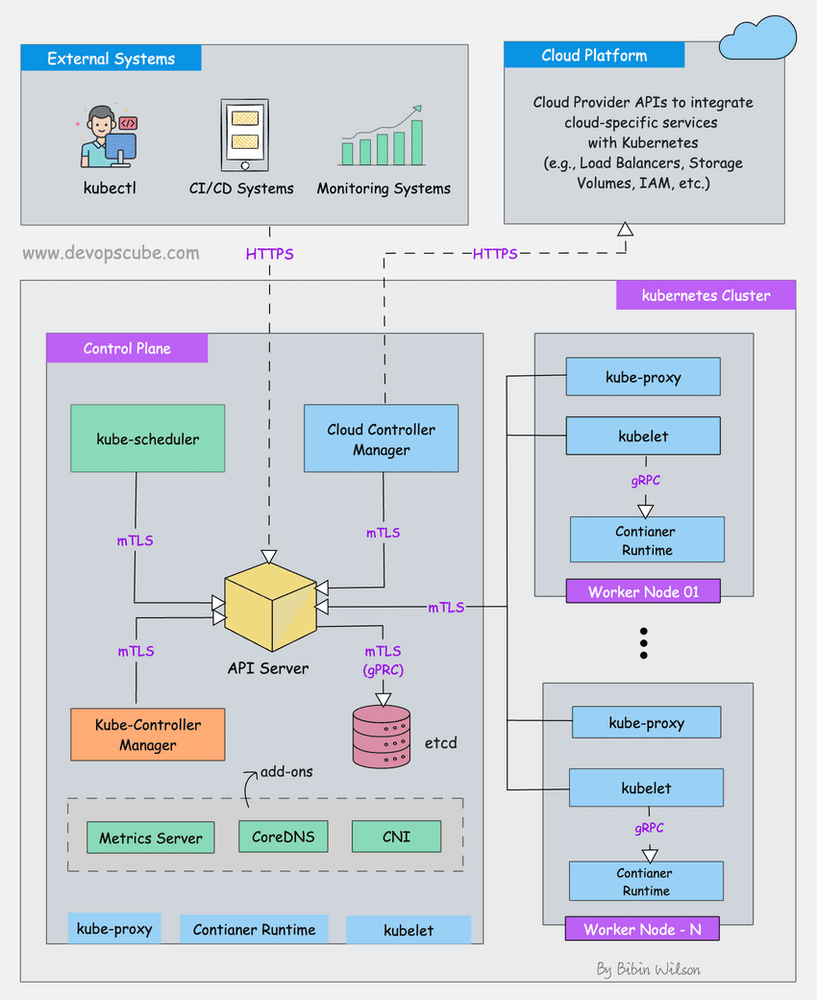

# KubernatesMyWay

## Overview

This repository contains a comprehensive guide and resources for setting up and managing Kubernetes clusters. It includes detailed notes, manifests, scenario-based questions, and command references for various Kubernetes components.

## Table of Contents

- [K8s Cluster Core Components](#k8s-cluster-core-components)
  - [ETCD](#ETCD)
  - [KubeScheduler](#KubeSchedulers)

  
ETCD

  - [ETCD Notes](ClusterCoreComponents/ControlPlane/ETCD/Notes.md)
  - [ETCD Manifest](ClusterCoreComponents/ControlPlane/ETCD/Manifest.yaml)
  - [ETCD Scenario Based Questions](ClusterCoreComponents/ControlPlane/ETCD/ExamQuestions.md)
  - [ETCD Commands](ClusterCoreComponents/ControlPlane/ETCD/commands.sh)

  
KubeScheduler

  - [KubeScheduler Notes](ClusterCoreComponents/ControlPlane/KubeScheduler/Notes.md)
  - [KubeScheduler Manifest](ClusterCoreComponents/ControlPlane/KubeScheduler/Manifest.yaml)
  - [KubeScheduler Scenario Based Questions](ClusterCoreComponents/ControlPlane/KubeScheduler/ExamQuestions.md)
  - [KubeScheduler Commands](ClusterCoreComponents/ControlPlane/KubeScheduler/commands.sh)

  
KubeControlManager

  - [KubeControlManager Notes](ClusterCoreComponents/ControlPlane/KubeControlManager/Notes.md)
  - [KubeControlManager Manifest](ClusterCoreComponents/ControlPlane/KubeControlManager/Manifest.yaml)
  - [KubeControlManager Scenario Based Questions](ClusterCoreComponents/ControlPlane/KubeControlManager/ExamQuestions.md)
  - [KubeControlManager Commands](ClusterCoreComponents/ControlPlane/KubeControlManager/commands.sh)

