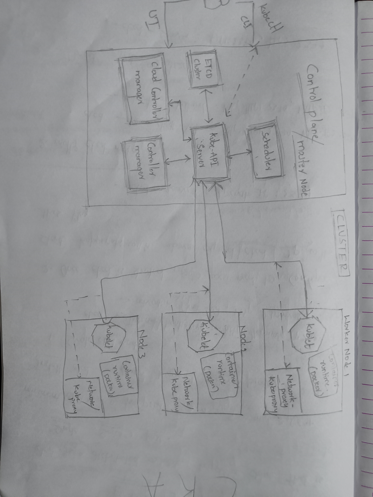

# KubernatesMyWay

## Overview

This repository contains a comprehensive guide and resources for setting up and managing Kubernetes clusters. It includes detailed notes, manifests, scenario-based questions, and command references for various Kubernetes components.

## Table of Contents

- [K8s Cluster Core Components](#k8s-cluster-core-components)
  - [ETCD](#etcd)

## K8s Cluster Core Components

  
ETCD

  - [ETCD Notes](Cluster%20Core%20Components/ControlPlane/ETCD/Notes.md)
  - [ETCD Manifest](Cluster%20Core%20Components/ControlPlane/ETCD/Manifest.yaml)
  - [ETCD Scenario Based Questions](Cluster%20Core%20Components/ControlPlane/ETCD/ExamQuestions.md)
  - [ETCD Commands](Cluster%20Core%20Components/ControlPlane/ETCD/commands.sh)

